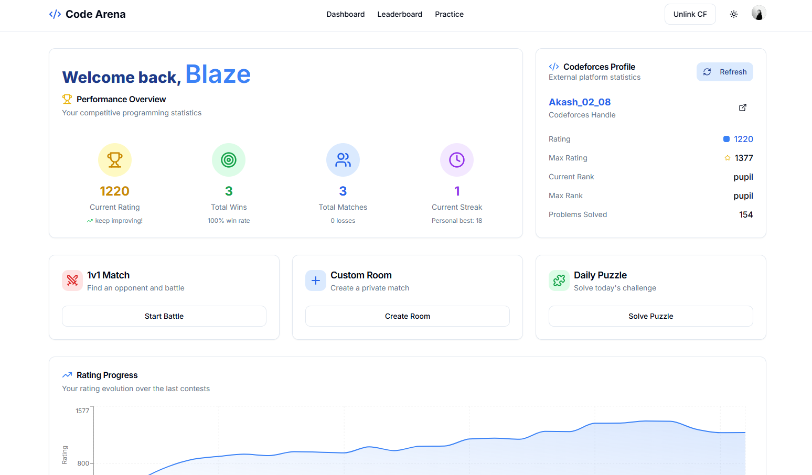
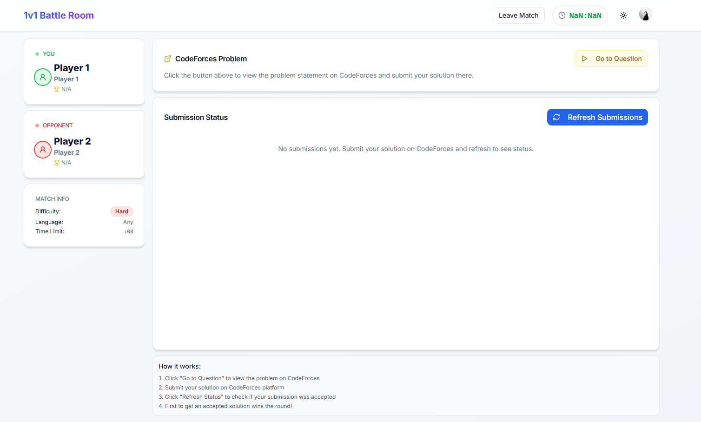
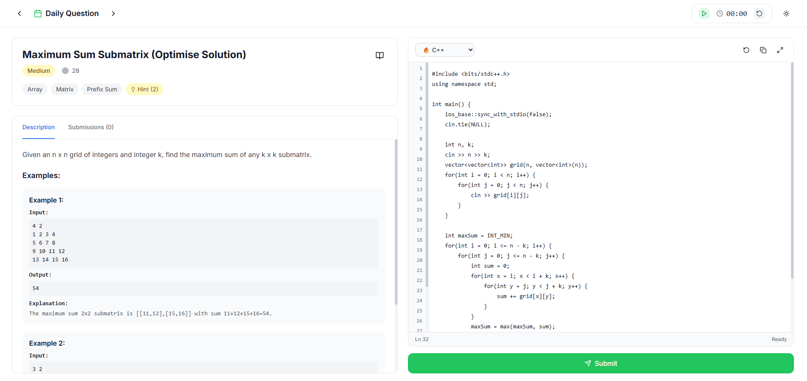

# Code Arena 

The ultimate 1v1 battleground for competitive programmers. Challenge peers, solve unique puzzles, and climb the leaderboard to prove your coding supremacy.

---

## 📋 Table of Contents
- [About The Project](#about-the-project)
- [✨ Features](#-features)
- [📸 Screenshots](#-screenshots)
- [🛠️ Tech Stack](#️-tech-stack)
- [🏗️ Project Structure](#️-project-structure)
- [🚀 Getting Started](#-getting-started)
  - [Prerequisites](#prerequisites)
  - [Installation](#installation)
  - [Environment Variables](#environment-variables)
  - [⚙️ Running The Project](#️-running-the-project)
- [🚢 Deployment](#-deployment)
- [🤝 Contributing](#-contributing)
- [📄 License](#-license)

---

## About The Project
**Code Arena** is a real-time, web-based platform tailored for competitive programmers seeking head-to-head battles. Beyond traditional algorithmic challenges, we introduce unique puzzle formats—debugging, syntax corrections, and optimization tasks—to test every aspect of your coding prowess. Whether you crave a quick rated match, a private duel with friends, or a daily brain-teaser, Code Arena delivers a fast, polished, and feature-rich experience. Powered by **Socket.IO** for real-time events and **Redux Toolkit** for state management, every match is seamless and thrilling.

---

## ✨ Features

- **1v1 Rated Matches**  
  - Queue for 10, 25, or 40-minute duels.  
  - ELO-based matchmaking, enhanced with your Codeforces rating.  
  - Match win/loss system

- **Custom Rooms**  
  - Create private rooms or mini-tournaments.  
  - Customize rules: rating brackets, problem types (DP, Graphs, Greedy, Trees).  
  - Invite peers with a simple room code.

- **Daily Puzzles**  
  - Fresh, unique challenges each day.  
  - Debug solutions, fix syntax errors, or optimize inefficient code.

- **Personalized Dashboard**  
  - Monitor rating, win/loss ratio, and streaks.  
  - Interactive rating progression chart.  
  - Detailed match history and activity log.

- **Codeforces Integration**  
  - Sync your Codeforces profile for accurate matchmaking.  
  - Enhanced initial pairing based on external stats.

- **Leaderboard**  
  - See where you stand among the best on Code Arena.

---

### 📸 Screenshots
### Dashboard


### Create/Join Room


### Match Room


### Daily Puzzle


---

## 🛠️ Tech Stack

| Category                | Technology                          |
| ----------------------- | ----------------------------------- |
| **Frontend**            | Next.js, React, TypeScript, Tailwind CSS |
| **State Management**    | Redux Toolkit                       |
| **Backend**             | Node.js, Express.js, TypeScript     |
| **Database**            | MongoDB (Mongoose)                  |
| **Real-time**           | Socket.IO                           |
| **Authentication**      | Clerk                               |
| **Deployment**          | Vercel (Frontend), Render (Backend) |
| **Version Control**     | Git, GitHub                         |
| **Package Manager**     | npm                                 |

---

## 🏗️ Project Structure

```
/code-arena
├── /client           # Next.js frontend
│   ├── /app
│   ├── /components
│   ├── /hooks
│   ├── /lib
│   └── /redux
└── /server           # Node.js backend
    ├── /src
    │   ├── /controllers
    │   ├── /models
    │   ├── /routes
    │   ├── /utils
    │   └── index.ts
```

---

## 🚀 Getting Started

### Prerequisites
- Node.js v18+  
- npm (included with Node.js)  
- Git  
- MongoDB (local or Atlas)

### Installation

1. **Clone the repository**  
   ```bash
   git clone https://github.com/your-username/code-arena.git
   cd code-arena
   ```

2. **Install dependencies**  
   ```bash
   cd server
   npm install
   cd ../client
   npm install
   ```

### Environment Variables

- Create `.env` in `/server`:

  ```
  MONGO_URI=your_mongo_connection_string
  CLERK_SECRET_KEY=your_clerk_secret_key
  PORT=8000
  CLIENT_URL=http://localhost:3000
  JWT_SECRET=your_jwt_secret
  ```

- Create `.env.local` in `/client`:

  ```
  NEXT_PUBLIC_CLERK_PUBLISHABLE_KEY=your_publishable_key
  CLERK_SECRET_KEY=your_clerk_secret_key
  NEXT_PUBLIC_SIGN_IN_URL=/sign-in
  NEXT_PUBLIC_SIGN_UP_URL=/sign-up
  NEXT_PUBLIC_AFTER_SIGN_IN_URL=/home
  NEXT_PUBLIC_AFTER_SIGN_UP_URL=/home
  NEXT_PUBLIC_API_URL=http://localhost:8000
  ```

### ⚙️ Running The Project

- **Backend**  
  ```bash
  cd server
  npm run dev
  ```

- **Frontend**  
  ```bash
  cd client
  npm run dev
  ```

Visit `http://localhost:3000` to explore Code Arena.

---

## 🚢 Deployment

- **Backend (Render)**  
  - Build: `npm install && npm run build`  
  - Start: `npm start`  
  - Add environment variables in Render dashboard.

- **Frontend (Vercel)**  
  - Connect GitHub repo.  
  - Set Next.js environment variables under Project Settings.

---

## 🤝 Contributing

Contributions are welcome! Please follow these steps:

1. Fork the repo  
2. Create a feature branch (`git checkout -b feature/YourFeature`)  
3. Commit your changes (`git commit -m 'Add YourFeature'`)  
4. Push to branch (`git push origin feature/YourFeature`)  
5. Open a Pull Request

---
