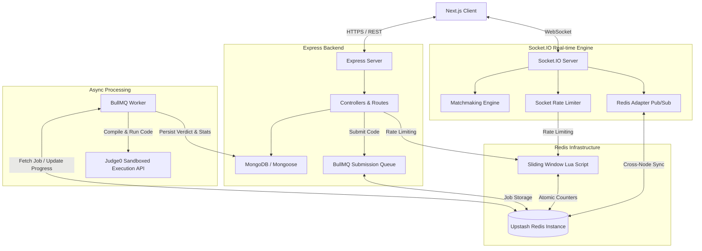
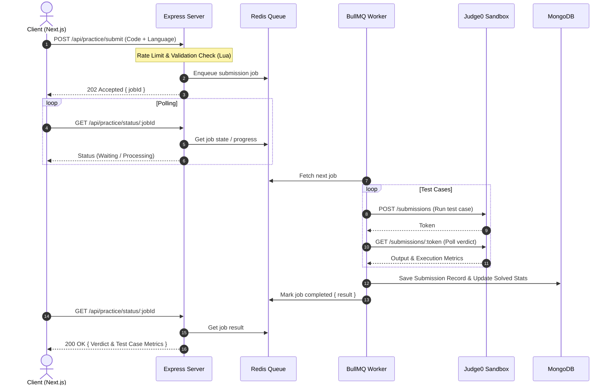
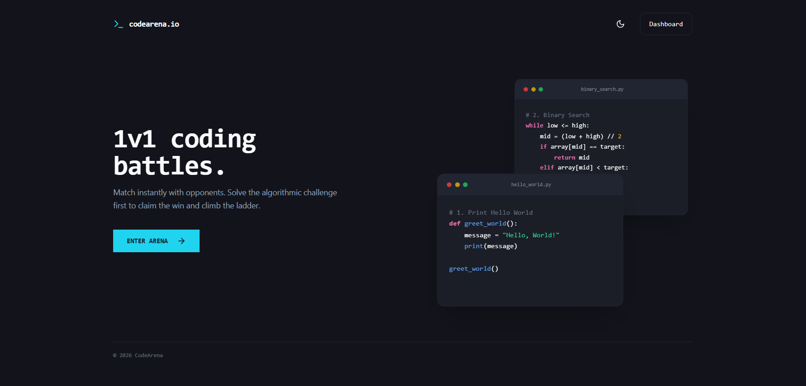
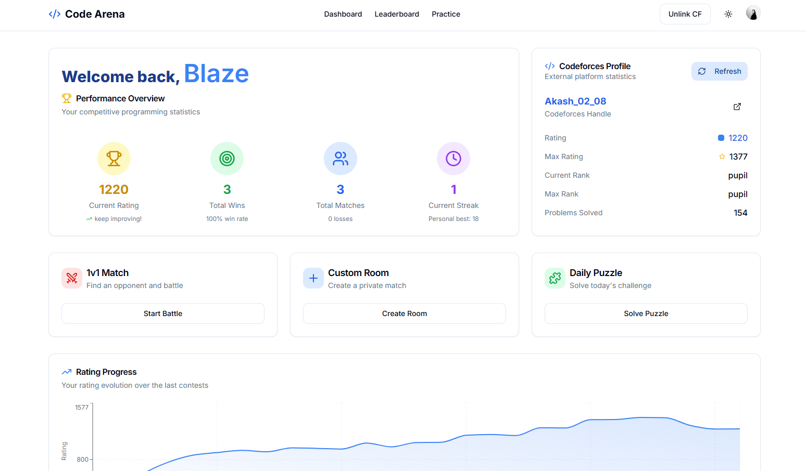
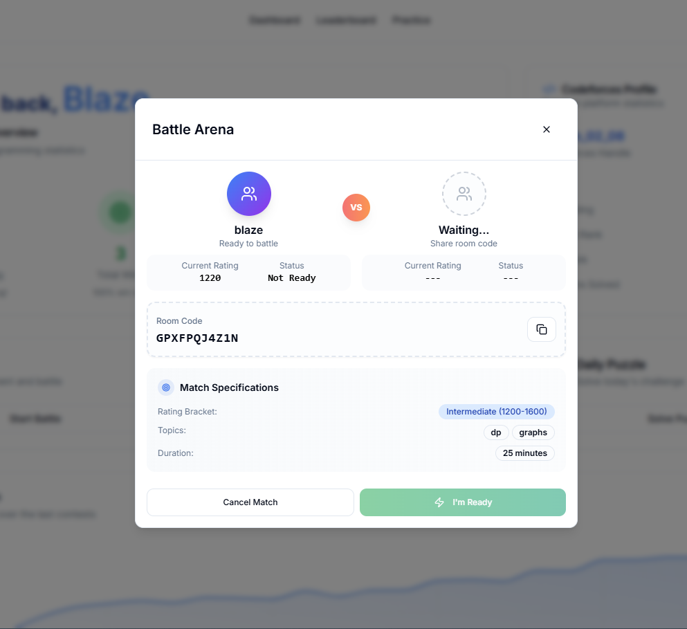
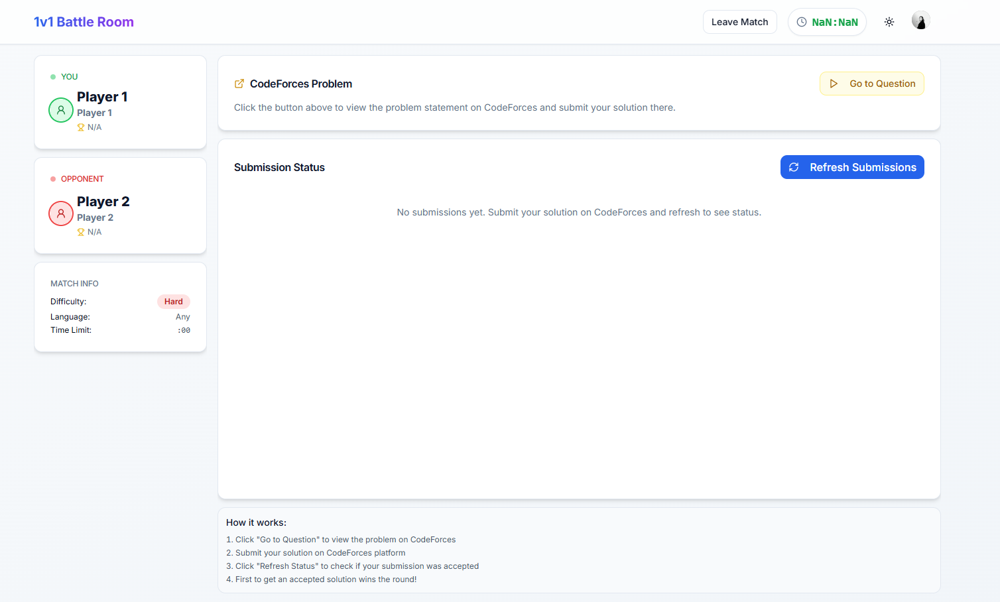
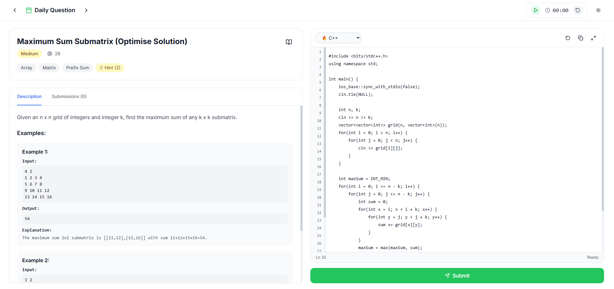

# CodeArena

A high-performance, real-time 1v1 competitive programming platform. CodeArena pairs developers in ELO-balanced match queues, runs sandboxed code executions against test suites, and tracks progress via dynamic user dashboards.

---

## Technical Specifications and Architecture

CodeArena is built on a decoupled, event-driven architecture designed for low latency, high concurrency, and horizontal scalability. The system separates HTTP APIs, stateful WebSocket communication, and heavy processing tasks into distinct, optimized layers.


```mermaid
graph TD
    Client[Next.js Client] <-->|HTTPS / REST| Express[Express Server]
    Client <-->|WebSocket| SocketServer[Socket.IO Server]
    
    subgraph Express Backend
        Express --> Controllers[Controllers & Routes]
        Controllers --> DB[MongoDB / Mongoose]
        Controllers -->|Submit Code| Queue[BullMQ Submission Queue]
    end
    
    subgraph Socket.IO Real-time Engine
        SocketServer --> Matchmaker[Matchmaking Engine]
        SocketServer --> SocketLimiter[Socket Rate Limiter]
        SocketServer --> SocketAdapter[Redis Adapter Pub/Sub]
    end
    
    subgraph Redis Infrastructure
        Queue <-->|Job Storage| Redis[(Upstash Redis Instance)]
        SocketAdapter <-->|Cross-Node Sync| Redis
        RateLimitLua[Sliding Window Lua Script] <-->|Atomic Counters| Redis
    end

    subgraph Async Processing
        Worker[BullMQ Worker] <-->|Fetch Job / Update Progress| Redis
        Worker -->|Compile & Run Code| Judge0[Judge0 Sandboxed Execution API]
        Worker -->|Persist Verdict & Stats| DB
    end

    Controllers -->|Rate Limiting| RateLimitLua
    SocketLimiter -->|Rate Limiting| RateLimitLua
```

### Component Architecture

| Component | Responsibility | Technology Stack |
| :--- | :--- | :--- |
| **Client Interface** | User dashboard, active match rooms, visual charts, live matchmaking interfaces, and daily puzzle workspaces. | Next.js, React, Tailwind CSS, Redux Toolkit, Recharts |
| **API Gateway** | REST API handling user profiles, leaderboard generation, static questions, and submission queries. | Node.js, Express.js, TypeScript |
| **Real-time Server** | Stateful WebSocket server managing matchmaking lobbies, custom room synchronizations, and match states. | Socket.IO, custom MatchMaker engine |
| **Shared Cache & Queue** | Distributed job queue storage, real-time message replication, rate-limiting tokens, and matchmaking active session maps. | Upstash Redis, BullMQ |
| **Task Processors** | Background worker threads running sandboxed code compilation, input verification, and db stats updates. | BullMQ Workers |
| **Code Sandbox** | Remote code execution environment running submissions in isolated secure runtimes. | Judge0 API |
| **Database** | Persistent storage of users, ratings, submission logs, and coding challenges. | MongoDB, Mongoose |

---

## Core Systems and Scalability Design

### Asynchronous Execution Pipeline (BullMQ)
Code compilation and test suite evaluations are computational tasks that shouldn't block the main Express server loop. CodeArena decouples code execution through a Redis-backed queue system:
* **Decoupled Request Loop**: Handlers validate submission requests and push execution payloads into a `submissions` queue, returning a `202 Accepted` status with a `jobId`.
* **State Polling**: The client polls `/api/practice/status/:jobId` to retrieve execution state.
* **Worker Execution**: Dedicated background worker threads pull jobs from Redis, submit test cases to the Judge0 sandbox, verify stdout differences, persist execution logs in MongoDB, and mark jobs as completed.
* **Resource Optimization**: Worker concurrency limits are configured to match target infrastructure memory boundaries (e.g., restricted to 2 concurrent runs on low-memory hosting structures to prevent OOM container crashes).


```mermaid
sequenceDiagram
    autonumber
    actor User as Client (Next.js)
    participant Server as Express Server
    participant Redis as Redis Queue
    participant Worker as BullMQ Worker
    participant Judge as Judge0 Sandbox
    participant DB as MongoDB

    User->>Server: POST /api/practice/submit (Code + Language)
    Note over Server: Rate Limit & Validation Check (Lua)
    Server->>Redis: Enqueue submission job
    Server-->>User: 202 Accepted { jobId }
    
    loop Polling
        User->>Server: GET /api/practice/status/:jobId
        Server->>Redis: Get job state / progress
        Server-->>User: Status (Waiting / Processing)
    end

    Worker->>Redis: Fetch next job
    loop Test Cases
        Worker->>Judge: POST /submissions (Run test case)
        Judge-->>Worker: Token
        Worker->>Judge: GET /submissions/:token (Poll verdict)
        Judge-->>Worker: Output & Execution Metrics
    end
    
    Worker->>DB: Save Submission Record & Update Solved Stats
    Worker->>Redis: Mark job completed { result }

    User->>Server: GET /api/practice/status/:jobId
    Server->>Redis: Get job result
    Server-->>User: 200 OK { Verdict & Test Case Metrics }
```

### Sliding-Window Rate Limiting (Redis Lua)
To safeguard server capacity and sandboxed compute budgets against volumetric flooding, CodeArena uses a custom sliding-window counter:
* **Atomic Scripting**: Rate-limit evaluation logic is written in Lua and sent to Redis via `EVAL`. This guarantees atomic transaction states and prevents race conditions under high-volume concurrency.
* **Sliding Window Tracking**: Sorted sets (`ZSET`) store timestamps of requests. Requests older than the configured window size are cleared using `ZREMRANGEBYSCORE` before calculating current rate bounds with `ZCARD`.
* **Layer Integration**: Implemented as standard Express middleware for REST endpoints, and as interceptors (`socket.use`) for Socket.IO event channels.

```
Key Prefix Conventions:
- REST Submit: codearena:ratelimit:submit:{userId}
- Socket Matchmaking: codearena:ratelimit:socket:matchmaking:{socketId}
- Socket Custom Rooms: codearena:ratelimit:socket:create_room:{socketId}
```

### Distributed WebSockets and Matchmaker Mapping
Stateful socket connections require synchronization to scale across multiple container nodes:
* **Pub/Sub Replication**: The `@socket.io/redis-adapter` syncs packets across separate servers using Upstash Redis. Clients connected to Node A can communicate instantly with clients connected to Node B.
* **Externalized Session States**: Active user configurations, opponent pairings, and active matchmaking sets are externalized to Redis hash structures (`HSET`, `SADD`). 
* **State Cleansing**: Disconnection events or match exits automatically clear cache configurations to prevent memory leaks and keep stats aligned with DB tables.

---

## Technical Stack

* **Frontend Framework**: Next.js 15, React 19, TypeScript
* **Styling**: Tailwind CSS, Framer Motion
* **State Management**: Redux Toolkit, Redux persist layers
* **Backend Architecture**: Node.js, Express.js (module type), TypeScript
* **Database Layer**: MongoDB, Mongoose ODM
* **Message Queue & Caching**: Upstash Redis (ioredis client, BullMQ)
* **Real-time Gateway**: Socket.IO, Socket.IO Redis Adapter
* **Identity Management**: Clerk SDK (express-clerk, nextjs-clerk)
* **Testing & Compiling**: Judge0 Sandboxed Execution API, ts-node, npx tsc

---

## Screenshots

### Application Landing Page


### Developer Dashboard


### Room Configuration Panel


### Active 1v1 Battle Arena


### Coding Workspace and Daily Puzzle


---

## Directory Layout

```
/code-arena
├── /client                       # Next.js App Router applications
│   ├── /app                      # Page components, route routing, and styles
│   │   ├── /(auth)               # Authenticated route groups (home, matchmaking, room, puzzle)
│   │   └── /globals.css          # Central tailwind directive layout
│   ├── /components               # Shared reusable interfaces (verification card, room modal)
│   ├── /hooks                    # API communication wrappers and WebSockets hooks
│   ├── /lib                      # Client caching utilities
│   └── /redux                    # Redux Toolkit store slices (user, room)
└── /server                       # Stateful API Express Gateway
    ├── /src
    │   ├── /config               # Redis and MongoDB database connections
    │   ├── /constants            # Shared status events and parameters
    │   ├── /controllers          # REST controller logic (submissions, codeforces sync)
    │   ├── /middlewares          # Auth verification, rate limiting, and errors handlers
    │   ├── /models               # Mongoose schemas (User, Question, Submissions)
    │   ├── /queues               # BullMQ configurations, job queues, and workers
    │   ├── /routes               # Endpoint groups (Practice, Features, User)
    │   └── /utils                # Redis state helpers and matchmaking algorithm files
    └── index.ts                  # Server startup, Socket.IO setups, and shutdown signals
```

---

## Getting Started

### Prerequisites
- Node.js v18 or higher
- npm (Node Package Manager)
- Running MongoDB instance
- Access to Upstash Redis (or local Redis instance)

### Installation

1. **Clone the repository**
   ```bash
   git clone https://github.com/your-username/code-arena.git
   cd code-arena
   ```

2. **Install dependencies**
   ```bash
   cd server
   npm install
   cd ../client
   npm install
   ```

### Environment Variables

- Create a `.env` file in the `/server` folder:
  ```
  PORT=5000
  CLIENT_URL=http://localhost:3000
  MONGO_URI=your_mongo_connection_string
  REDIS_URL=redis://127.0.0.1:6379
  CLERK_SECRET_KEY=your_clerk_secret_key
  NEXT_PUBLIC_CLERK_PUBLISHABLE_KEY=your_clerk_publishable_key
  CLERK_WEBHOOK_SIGNING_SECRET=your_clerk_webhook_signing_secret
  JUDGE0_API_URL=https://judge0-ce.p.rapidapi.com
  JUDGE0_API_KEY=your_rapidapi_judge0_key
  ```

- Create a `.env.local` file in the `/client` folder:
  ```
  NEXT_PUBLIC_CLERK_PUBLISHABLE_KEY=your_publishable_key
  CLERK_SECRET_KEY=your_clerk_secret_key
  NEXT_PUBLIC_SIGN_IN_URL=/login
  NEXT_PUBLIC_SIGN_UP_URL=/signup
  NEXT_PUBLIC_AFTER_SIGN_IN_URL=/home
  NEXT_PUBLIC_AFTER_SIGN_UP_URL=/home
  NEXT_PUBLIC_API_URL=http://localhost:5000
  ```

### Running The Project

- **Backend**
  ```bash
  cd server
  npm run dev
  ```

- **Frontend**
  ```bash
  cd client
  npm run dev
  ```

The client dashboard is accessible at `http://localhost:3000`.

---

## Deployment

- **Backend (Render)**
  - Build Command: `npm install && npm run build`
  - Start Command: `npm start`
  - Ensure all environment variables are populated in the Render dashboard.

- **Frontend (Vercel)**
  - Connect your repository to Vercel.
  - Set Next.js environment variables under Project Settings.
  - Deploy.

---

## Contributing

Contributions are welcome. Please follow these steps:

1. Fork the repository.
2. Create a feature branch (`git checkout -b feature/YourFeature`).
3. Commit your changes (`git commit -m 'Add YourFeature'`).
4. Push to the branch (`git push origin feature/YourFeature`).
5. Open a Pull Request.

---

## License

This project is licensed under the MIT License. Refer to the LICENSE file for details.
